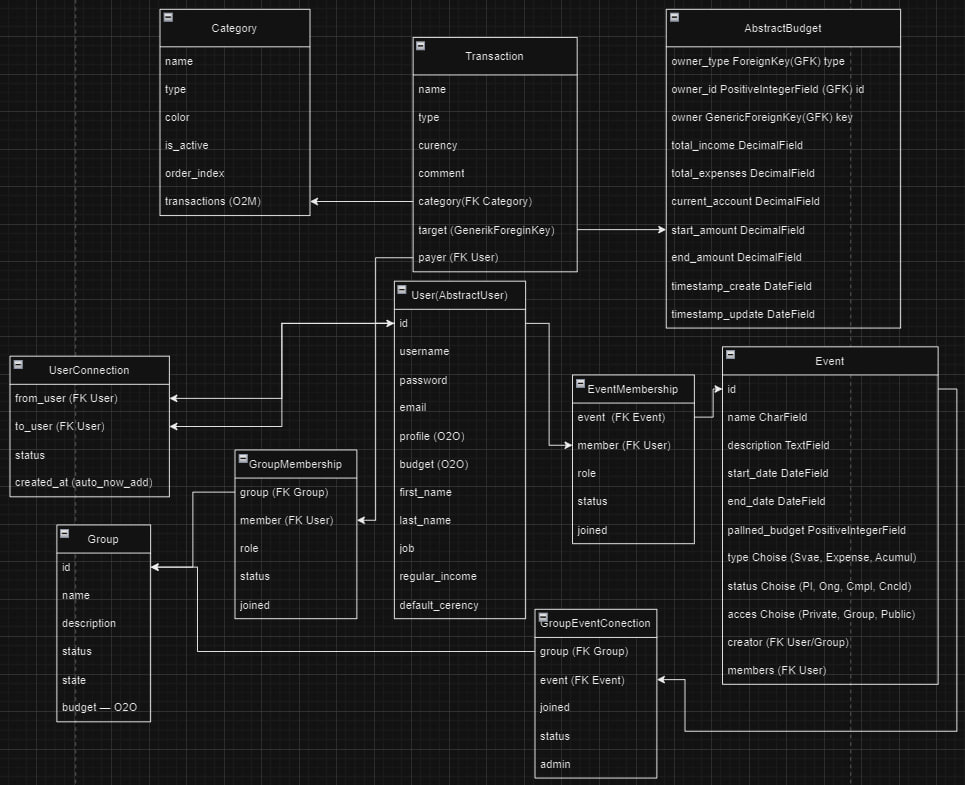

### 🧪 Test Accounts

Use the following credentials to test functionality. All accounts have the same
password.

| Username           | Password   | Role / Job        |
|:-------------------|:-----------|:------------------|
| **admin_tester**   | `1Qazcde3` | QA Manager        |
| **dev_tester**     | `1Qazcde3` | Software Engineer |
| **user_tester**    | `1Qazcde3` | Accountant        |
| **analyst_tester** | `1Qazcde3` | Data Analyst      |
| **manager_tester** | `1Qazcde3` | Project Manager   |

> **Note:** This data is generated automatically using a custom command
`python manage.py setup_dev_db`.

## 🚀 Quick Start
1. Run migrations: `python manage.py migrate`
2. Fill the database with test data: `python manage.py setup_dev_db`
3. Use the data from the table below to log in.

# Finanser

A comprehensive financial management system designed to track budgets, expenses, and transfers between individual users, shared events, and community groups.

## 🚀 Project Overview

Financer is built on a modular architecture that allows users to manage personal finances while seamlessly interacting with collective entities like **Events** and **Groups**. The core of the system is a robust transaction engine that ensures every entity has its own financial identity through an automated budgeting system.

## 🏗 Project Structure

The application is divided into five specialized modules:

* **`accounts/`** Handles user authentication, registration, and profile management. It includes a "Community" hub for viewing all users and managing social connections.
* **`finances/`** The core business logic of the system. It defines `Budget`, `Transaction`, and `Category` models. This module includes automated signals that generate a unique budget for every User, Event, or Group upon creation.
* **`events/`** Dedicated to the creation and lifecycle management of one-time or recurring events.
* **`groups/`** Manages long-term communities and groups, including the ability to host internal events specific to a group's members.
* **`dashboard/`** The visualization layer. It aggregates financial data and generates charts and statistics to provide users with insights into their spending and income.

## 💳 Core Financial Logic

### 1. Unified Budgeting System (GFK)
All entities (**User**, **Event**, and **Group**) automatically receive a dedicated `Budget` instance via Django Signals. These are linked using **Generic Foreign Keys (GFK)**, allowing the financial engine to treat every entity as a potential financial target.

### 2. Transaction Flow
All financial movement is handled by the `Transaction` model:
* **Payer:** Always an authenticated `User`.
* **Target:** Always a specific `Budget` (associated with a User, Event, or Group).
* **Control:** All operations are strictly managed by the centralized `TransfersService` located in `finances/services/transfers_service.py`.

### 3. Memberships & Connections
Permissions and financial interactions are established through intermediary membership tables:
* `EventMembership`: Connects users to specific events.
* `GroupMembership`: Connects users to specific groups.
* `GroupEventConnection`: Manages the relationship between groups and their internal events.

## 📊 Data Aggregation & Analytics
The **`dashboard`** application serves as the analytics engine. It uses specialized services to query transaction data and format it for frontend charts and diagrams, providing a clear overview of financial health across all personal and shared budgets.